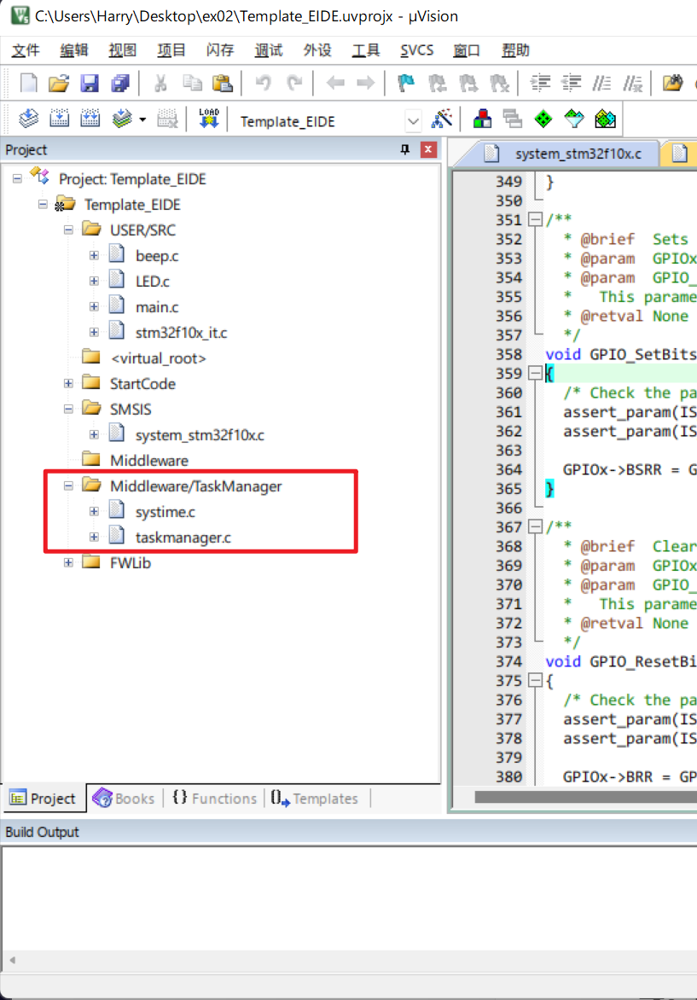
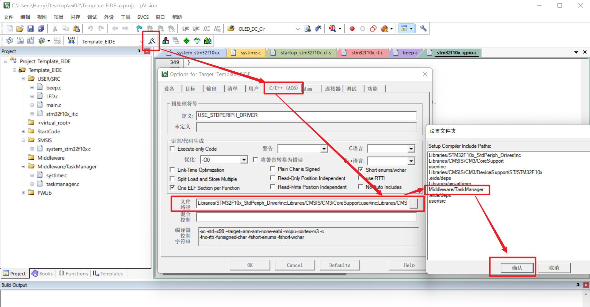

# 1. 简介

## 1.1 系统简介

基于循环时间的跨平台任务管理系统（可用于MCS51，STM32等单片机）

## 1.2 文件目录说明

- `TaskManager_c`：c语言实现的任务管理系统

- `TaskManager_cpp`：c++实现的任务管理系统

- `Demo`：提供多种示例，涵盖电脑模拟器（MSVC），STM32，8081等多种运行环境

# 2. 用法（C语言版）

## 2.1 API用法

**系统配置**（`TaskManager_config.h`）：

- `MAX_TASK_NUM`：最大任务数量，默认为10个，根据自己的需要修改
- `SYS_CYCLE_TIME`：系统的循环时间（单位为ms），默认为 1，表示1ms
- 编译器：目前支持的编译器为 `ARM_KILL` (AC5和AV6均可) 和 `WIN_MSVC`

**API接口**（`TaskManager_c`）：

- `TaskMsg`：【结构体】任务信息，结构体成员为 **任务函数，开始时间，周期时间，运行次数，PID**

    > 任务函数：只能是无参数，无返回值的函数
    >
    > 开始时间：任务开始运行的时间，`START_NOW` 表示立即开始运行
    >
    > 周期时间：任务每`周期时间`运行一次
    >
    > 运行次数：任务需要运行的次数，`RUN_FOREVER` 表示无穷次
    >
    > PID：任务变号，初始化的时候传入 `0`


- `void TM_init()`：系统初始化

- `uint32_t TM_add_task(TaskMsg* new_task_msg)`：添加任务

- `void TM_kill_by_PID(uint32_t PID)`：通过任务序号删除任务

- `void TM_kill_by_taskmsg(TaskMsg* task_msg)`：通过任务信息删除任务

- `void TM_run(void)`：运行系统

**示例代码**：

```c
#include "taskmanager.h"
#include "TaskManager_config.h"
#include "stdio.h"

// 任务1
void task1(void)
{
    printf("task1!\n");
}

// 任务2
void task2(void)
{
    printf("task2!\n");
}

void main(void)
{
    TM_init();
    // 任务1立即启动，每2ms中运行一次，无休无止的运行
    TaskMsg tasks_msg1 = { task1,START_NOW,2,RUN_FOREVER,0 };
    TM_add_task(&tasks_msg1);
    // 任务2在1ms之后启动，每4ms运行一次，运行5次自动结束
    TaskMsg tasks_msg2 = { task2,1,4,5,0 };
    TM_add_task(&tasks_msg2);
    while (1)
    {
        // 任务管理器启动
        TM_run();
    }
}
```


## 2.2 移植方法

将 `TaskManager_c` 添加到程序目录下，引用 `taskmanager.h` ， `TaskManager_config.h` 和 `systime.h` 并配置时钟即可。

以移植STM32F107为例，说明如下：

**Step1:添加项目文件**

- 添加c文件到项目目录



- 添加头文件路径

  

  

**Step2: 更改系统头文件**

进入 `TaskManager_config.h` ，查看如下代码

```c
// 跨平台移植，处理编译器
#ifdef ARM_KILL         // kill编译器
    #include "stm32f10x_conf.h"
#endif
```

将 `stm32f10x_conf.h` 换成系统相关的文件（标准库）

如果使用HAL库，请根据以下内容自行修改

> 此头文件有以下用处：
>
> - 引入 `uint32_t` ，`uint8_t` 等数据类型定义
> - 系统时钟初始化，根据情况，更改 `TM_init()` 函数内 `SysTick_Config(SYS_CYCLE_TIME * 72000000 / 1000);`，完成系统初始化

**Step3: 更改滴答计时器的初始化**

在 `stm32f10x_it.c` 中，覆盖原有的 `SysTick_Handler` 中断服务函数

```C
#include "systime.h"

void SysTick_Handler(void)
{
  update_systime();
}
```

# 3. 系统原理

# 4. 碎碎念

## 4.1 TODO

 **欢迎大家一起完成！**

- [x] 提供STM32标准库版本
- [ ] 提供 HAL 库版本
- [ ] 完成c++版本程序
- [ ] 支持带形参的任务
- [ ] 为更多平台提供移植 demo


## 4.2 联系我

bilibili：[小小up不会起名](https://space.bilibili.com/393609791)

邮箱：18221197@bjtu.edu.cn

